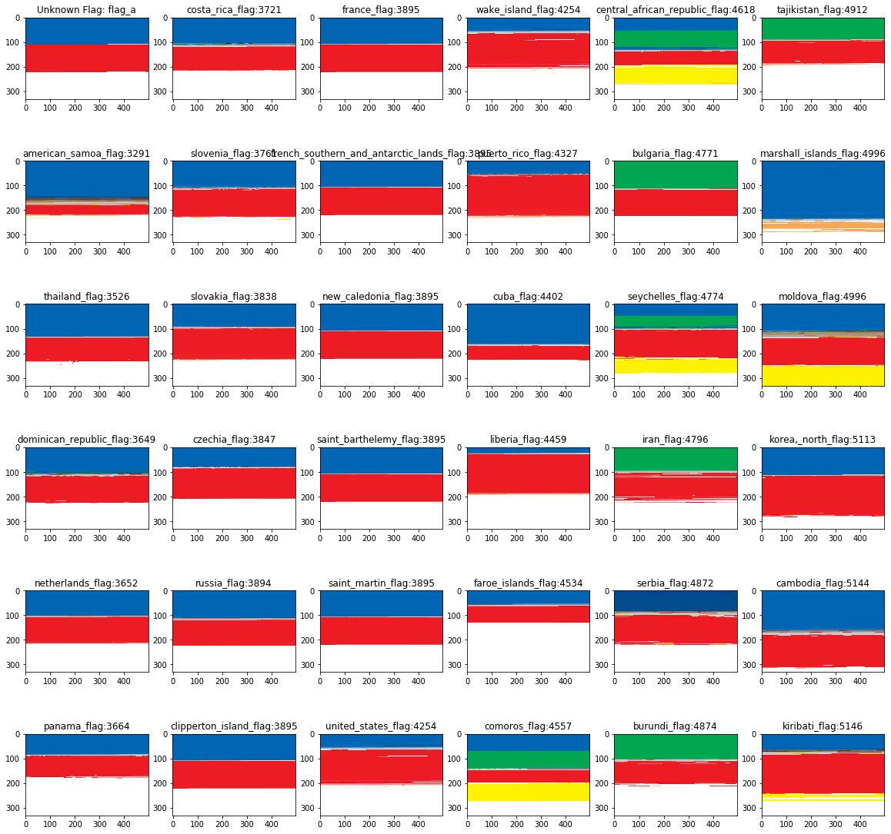
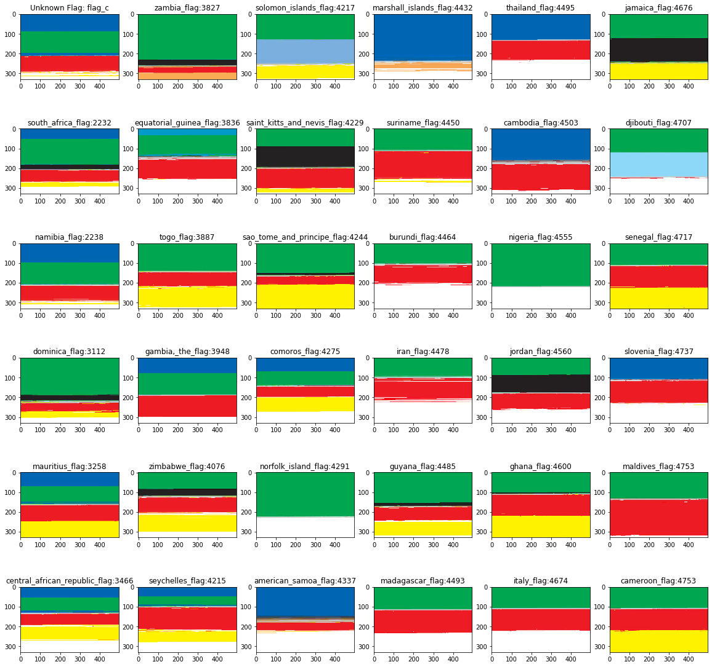

# 538---Vexing-Vexillogy-Puzzle

## The puzzle
In this puzzle we had to determine what country 3 scrambled flags belonged to.
Link to puzzle: https://fivethirtyeight.com/features/can-you-solve-the-vexing-vexillology/

Flag A:

Flag B: 

Flag C:

## My Solution
I needed a way to compare these scrambled flags to all of the unscrambled flags.

The most obvious way to do this is just sort by pixel color. I wrote some python code to modify an image by sorting its pixels by color which I could then use to compare to known flags which had undergone the same sorting.

To get my known flag dataset I scraped [the cia world factbook](https://www.cia.gov/library/publications/the-world-factbook/docs/flagsoftheworld.html) which contains all of the worlds flags easily downloadable.

I then sorted the pixels of both the unknown and known flags.

To save myself the effort of manually comparing hundreds of flags against the unknown flags I used a [RMSE Algorithm](https://www.statisticshowto.datasciencecentral.com/rmse/) to get a rough comparison of the similarity between the sorted flags.

I then looked at the top 35 matches manually and chose what I thought were the best options.

Here is what the sorted flags look like in comparison with the top 35 known sorted flags along with the associated RMSE values between the unknown sorted flag and the known sorted flags.

Flag A is 1:1:1 red white and blue. This could either be France, Russia, or the Netherlands. Lets go with the Netherlands since it's the least obvious choice and thus maximizes our chance of being the only one who got this correct.

Flag B is clearly only a good match with Brazil

Flag C is a bit more tough than the first two but based on the lack of any black in the unknown flag Nambia seems like the best choice.

So there are my three choices:

Flag A: Netherlands (also could be France or Russia)
Flag B: Brazil
Flag C: Nambia

